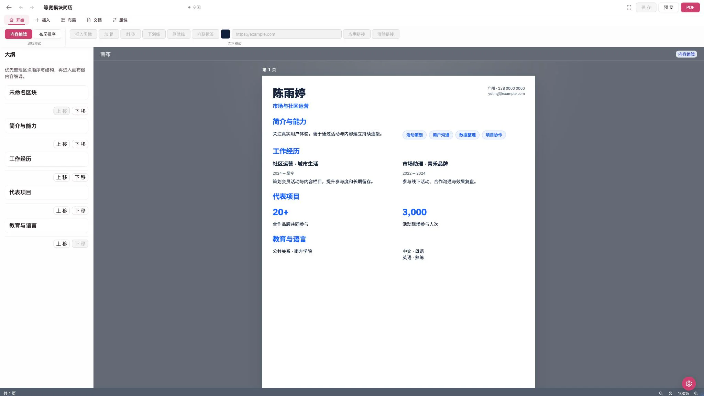

<p align="center">
  
</p>

<p align="center">
  <strong>让每段经历，以专业方式被看见。</strong>
</p>

<p align="center">
  简体中文 · <a href="./README.en.md">English</a>
</p>

> [!IMPORTANT]
> 当前所有版本均为尝鲜测试版本，尚未完全稳定，仍可能存在较多问题。正式版本预计随 v2 发布，敬请期待。

<p align="center">
  <a href="./LICENSE"></a>
  
  
  
</p>

<p align="center">
  <a href="https://anonresume.zqdesigned.city">在线体验</a> ·
  <a href="#快速开始">快速开始</a> ·
  <a href="#功能亮点">功能亮点</a> ·
  <a href="#参与贡献">参与贡献</a>
</p>

AnonResume 是一款开源的在线简历编辑器。你可以像编辑文档一样整理经历，实时查看最终排版，从模板开始创作或导入已有 Markdown 内容，并将简历发布为公开链接或导出为 PDF。

编辑器、预览、公开页面和 PDF 使用同一套渲染能力，尽可能减少“编辑时正常，导出后变样”的意外。项目支持自行部署，数据和运行环境由部署者掌控。



## 功能亮点

|  |  |
| --- | --- |
| **边写边看最终效果**<br />在 A4 画布中实时编辑和预览，分页变化立即可见。 | **从不同风格开始创作**<br />内置多种排版差异明确的模板，内容不变也能快速尝试新风格。 |
| **内容与样式都能细调**<br />调整区块、分栏、字体、颜色、间距和图标，也可以为局部文字或单个标题单独设置样式。 | **导入已有 Markdown 简历**<br />把已有内容带入编辑器继续完善，并支持针对木及简历格式的解析。 |
| **放心修改与恢复**<br />自动保留有限数量的历史版本，并直接在简历画面中查看差异后恢复。 | **分享与 PDF 导出**<br />发布只读简历链接，或通过带排队状态、取消和重试能力的任务系统导出 PDF。 |
| **完整的账号与管理能力**<br />支持邮箱验证、角色权限、审计记录、账号停用与安全审批。 | **独立的管理身份保护**<br />管理模式使用单独会话和虚拟 MFA 验证，超管账号仅用于管理。 |

编辑器针对桌面端的精细操作设计。移动端仍可进入工作台，完成预览、发布和下载等适合小屏幕的操作。

## 快速开始

### 环境要求

- [Bun](https://bun.sh/) 1.3 或更高版本
- [PostgreSQL](https://www.postgresql.org/) 14 或更高版本
- 用于 PDF 导出的 Chromium 运行环境

### 本地运行

```bash
git clone https://github.com/Sapphire-Learning-Hub/AnonResume.git
cd AnonResume
bun install
cp .env.example .env.local
```

编辑 `.env.local`，至少准备可用的 PostgreSQL 连接、Better Auth 地址与密钥。随后初始化数据库并安装 PDF 导出所需的浏览器：

```bash
bun run auth:migrate
bun run db:migrate
bunx playwright install chromium
```

启动 Web 应用：

```bash
bun run dev
```

如需使用 PDF 导出，请在另一个终端启动 Worker：

```bash
bun run worker:pdf
```

默认开发地址为 <http://localhost:3000>。

## 配置说明

[`.env.example`](./.env.example) 是配置项的唯一参考清单，其中包含安全占位值和用途说明。生产环境必须显式提供其中标记为必需的配置，可选项可以省略；缺少必需配置、格式错误或配置相互冲突会使实例进入全局维护状态，页面显示配置错误，操作请求返回 HTTP 503。

需要特别关注的配置包括：

- `BETTER_AUTH_URL` 必须是最终对外提供服务的 HTTPS Origin。
- SMTP 配置用于邮箱验证和管理员激活；开发环境在配置完整时也会正常发送邮件。
- `PDF_EXPORT_*` 控制导出并发、全局队列、单用户任务数、重试、租约和结果有效期。
- 匿名 PDF 导出默认禁止。虽然可以通过环境变量开启，但不建议在缺少外部滥用防护时这样做。
- `RESUME_VERSION_HISTORY_LIMIT` 控制每份简历保留的历史版本数量。
- `ANONRESUME_SUPER_ADMIN_EMAIL` 和 `ADMIN_*` 配置用于唯一超管、管理会话及 MFA 安全能力。
- GitHub OAuth 是可选功能；客户端 ID 与密钥必须同时配置或同时省略。

数据库结构只通过 Better Auth 与 Drizzle 迁移更新，应用请求不会在运行时创建或修复表结构。

## 生产部署

安装锁定依赖并完成生产构建：

```bash
bun install --frozen-lockfile
bun run build
```

在启动新版本前应用迁移：

```bash
bun run auth:migrate
bun run db:migrate
```

分别运行 Web 服务和 PDF Worker：

```bash
bun run start
bun run worker:pdf
```

两者需要连接同一个 PostgreSQL 数据库，并使用一致的应用配置。PDF Worker 可以运行多个进程，但 `PDF_EXPORT_MAX_CONCURRENCY` 是通过 PostgreSQL 在全局范围内限制的，而不是每个 Worker 单独计算。

生产环境应使用权限受限的专用数据库账号，并备份简历与历史版本数据。PDF 导出任务包含临时队列和下载数据，通常不需要长期备份。

## 管理与安全

- 系统首次启动时可创建唯一的待激活超管；检测到多个超管会阻止管理服务继续运行，并提供 CLI 修复工具。
- 超管账号不具备普通简历功能。普通用户可以拥有一个或多个管理角色，并在进入管理模式时进行额外 MFA 验证。
- 支持虚拟 MFA 设备、一次性恢复码、多设备绑定、重新认证和普通管理员 MFA 重置审批。
- 管理端提供用户、简历、导出队列、角色权限、系统状态、安全审批和审计管理。
- 审计记录保留操作类型、资源标识、结果和变更详情，并在可用时同时展示可读值与原始值。

如果唯一超管同时丢失 MFA 设备和恢复码，请在服务器上使用 `bun run admin:reset-mfa`，不要通过数据库手工绕过安全流程。

## 技术栈

AnonResume 使用 Next.js 16、React 19、TypeScript、Ant Design、Tiptap、Zustand、Better Auth、Drizzle ORM、PostgreSQL 与 Playwright 构建，并使用 Bun 管理依赖和运行脚本。

## 常用命令

| 命令 | 用途 |
| --- | --- |
| `bun run dev` | 启动开发服务器 |
| `bun run worker:pdf` | 启动 PDF 导出 Worker |
| `bun run check` | 运行 ESLint、样式规则、类型检查和完整测试 |
| `bun run build` | 创建生产构建 |
| `bun run auth:migrate` | 应用 Better Auth 数据库迁移 |
| `bun run db:migrate` | 应用项目数据库迁移 |
| `bun run admin:doctor` | 检查管理系统状态 |
| `bun run admin:repair-super-admin` | 修复多超管异常状态 |
| `bun run admin:reset-mfa` | 通过 CLI 重置超管 MFA |

提交公开版本前请至少运行：

```bash
bun run check
bun run build
```

## 参与贡献

欢迎提交错误报告、功能建议和代码改进。请阅读[贡献指南](./CONTRIBUTING.md)，
了解分支、提交、Pull Request、评审、合并和发布流程。

安全漏洞请通过 [GitHub 私密漏洞报告](https://github.com/Sapphire-Learning-Hub/AnonResume/security/advisories/new)
提交，不要创建公开 Issue。

## 许可证与品牌

源代码使用 [GNU Affero General Public License v3.0 or later](./LICENSE) 许可。分发修改版本或通过网络向用户提供修改后的服务时，请遵守 AGPL 的相应义务。

项目内字体、图标及其他第三方资源保留各自的许可，详见 [`THIRD_PARTY_NOTICES`](./THIRD_PARTY_NOTICES)。AnonResume 的 Logo 与品牌素材受单独的 [`BRAND-NOTICE.md`](./BRAND-NOTICE.md) 约束，不属于源代码许可证的授权范围。

---

<p align="center">
  如果 AnonResume 对你有帮助，欢迎 Star、反馈问题或参与改进。
</p>
